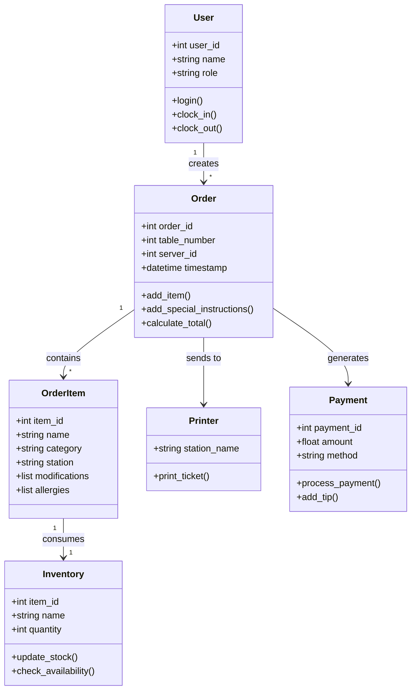

```mermaid
classDiagram
    class User {
        +int user_id
        +string name
        +string role
        +login()
        +clock_in()
        +clock_out()
    }

    class Order {
        +int order_id
        +int table_number
        +int server_id
        +datetime timestamp
        +add_item()
        +add_special_instructions()
        +calculate_total()
    }

    class OrderItem {
        +int item_id
        +string name
        +string category
        +string station
        +list modifications
        +list allergies
    }

    class Inventory {
        +int item_id
        +string name
        +int quantity
        +update_stock()
        +check_availability()
    }

    class Printer {
        +string station_name
        +print_ticket()
    }

    class Payment {
        +int payment_id
        +float amount
        +string method
        +process_payment()
        +add_tip()
    }

    User "1" --> "*" Order : creates
    Order "1" --> "*" OrderItem : contains
    OrderItem "1" --> "1" Inventory : consumes
    Order --> Printer : sends to
    Order --> Payment : generates
```
